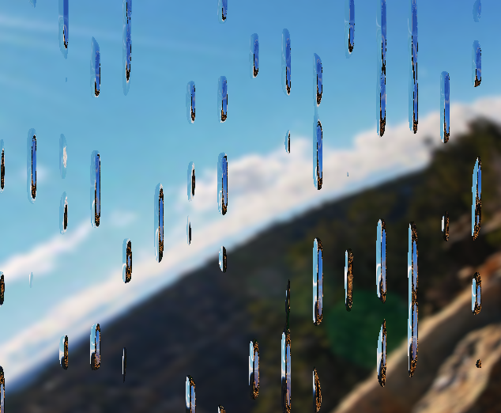

# Raindrops Shader
## abstract
simplex noise で各fragmentに存在する水滴の厚さを求め、その少し右と少し下の位置の水滴の厚さとの差（勾配）によって光を屈折させる方向を決定する。

## 水滴の形状の決定
- 上から下へ落ちていく水滴、位置が固定された水滴、一瞬だけ表示される壁にぶつかった雨を表現する水滴の3種類が存在する。
- simplex noise を累乗して、smoothstep(0.01, 1.0, noise) で値の小さい部分を0に丸めることで、水滴の形状を表現した。

### 位置を固定した水滴
3種類の水滴のうち、位置が固定された水滴のみ、ノイズに入力の異なる2つの simplex noise の和を使い、水滴の輪郭の滑らかさを下げた。


### 上から落ちてくる水滴
上から落ちてくる水滴は、単純にノイズを縦方向にスクロールさせるだけでは不自然に見えるため、それぞれの水滴が独立して動作しているように見せる必要がある。そこで、上から落ちてくる水滴は4つのレイヤーの和として構成し、各レイヤーはノイズとレイヤーごとにoffsetの異なるsin波の積 (図1) とした。これにより、横に隣り合う水滴同士が同じパターンで動き、壁全体が動いているかのように見える問題を修正した。

> \
> 図1

加えて、それだけでは真下方向にしか雨が落ちないのが不自然だったため、レイヤー内の各座標を simplex noise で歪ませ、雨が斜め方向にも落ちるようにした。（図2）
> 
> 図2

simplex noise の累乗数を上げて雨粒の大きさを十分に小さくし、4つのレイヤーを重ねると図3のようになる。
> 
> 図3

各レイヤーに属する水滴のy座標の位置は、図6の関数に従う。ただし、縦軸はy座標（正方向が下）、横軸は時間。レイヤーごとに周期とoffsetをずらした。

> 
> 図6

### 一瞬だけ表示される水滴
3Dの simplex noise に (x, y, time) を入力している。（図4）

> 
> 図4

## 光の屈折
three.jsの postprocessing pass として実装した。postprocessing pass は1つ前のpassの出力画像をテクスチャとして受け取り、次のpass（あるいはこのpassが最後ならキャンバス）に新しい画像を出力する。

光の屈折は、x軸上で水滴が増加関数にある点では出力するテクスチャ上の座標を水滴の厚みの勾配に比例してずらすことで表現した。（図5）

> 
> 図5

## blur
水滴のない部分は周囲のテクスチャの座標の値の平均をとってぼかしている。

## マウスカーソルの軌跡
mouse0に現在のマウス座標（マウスが動いていないなら (-1, -1) にしてshader側で無視)、それ以前に以前の時刻の座標が入っていて、mouse0とmouse1、mouse1とmouse2、...をそれぞれ線分でつないで、線分に近いところはエフェクトを当てていない。

```c
if (mouse8.x >= 0.0 && mouse9.x >= 0.0 && sdSegment(vUv * vec2(aspect, 1.0), mouse8 * vec2(aspect, 1.0), mouse9 * vec2(aspect, 1.0)) < 0.03) { opacity = 1.0; }
if (mouse7.x >= 0.0 && mouse8.x >= 0.0 && sdSegment(vUv * vec2(aspect, 1.0), mouse7 * vec2(aspect, 1.0), mouse8 * vec2(aspect, 1.0)) < 0.03) { opacity = 1.0; }
if (mouse6.x >= 0.0 && mouse7.x >= 0.0 && sdSegment(vUv * vec2(aspect, 1.0), mouse6 * vec2(aspect, 1.0), mouse7 * vec2(aspect, 1.0)) < 0.03) { opacity = 1.0; }
if (mouse5.x >= 0.0 && mouse6.x >= 0.0 && sdSegment(vUv * vec2(aspect, 1.0), mouse5 * vec2(aspect, 1.0), mouse6 * vec2(aspect, 1.0)) < 0.03) { opacity = 1.0; }
if (mouse4.x >= 0.0 && mouse5.x >= 0.0 && sdSegment(vUv * vec2(aspect, 1.0), mouse4 * vec2(aspect, 1.0), mouse5 * vec2(aspect, 1.0)) < 0.03) { opacity = 1.0; }
if (mouse3.x >= 0.0 && mouse4.x >= 0.0 && sdSegment(vUv * vec2(aspect, 1.0), mouse3 * vec2(aspect, 1.0), mouse4 * vec2(aspect, 1.0)) < 0.03) { opacity = 0.7; }
if (mouse2.x >= 0.0 && mouse3.x >= 0.0 && sdSegment(vUv * vec2(aspect, 1.0), mouse2 * vec2(aspect, 1.0), mouse3 * vec2(aspect, 1.0)) < 0.03) { opacity = 0.5; }
if (mouse1.x >= 0.0 && mouse2.x >= 0.0 && sdSegment(vUv * vec2(aspect, 1.0), mouse1 * vec2(aspect, 1.0), mouse2 * vec2(aspect, 1.0)) < 0.03) { opacity = 0.3; }
if (mouse0.x >= 0.0 && mouse1.x >= 0.0 && sdSegment(vUv * vec2(aspect, 1.0), mouse0 * vec2(aspect, 1.0), mouse1 * vec2(aspect, 1.0)) < 0.03) { opacity = 0.1; }
```

```typescript
for (let i = numMouseTrails - 2; i >= 0; i--) {
    pass!.uniforms[`mouse${i + 1}`]!.value.copy(pass!.uniforms[`mouse${i}`]!.value)
}
pass!.uniforms.mouse0!.value.set(-1.0, -1.0, -1.0)
```


